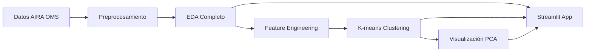

<div align="center">

# 🏥 AIRA - Análisis de Preparación para IA en Salud

### *Assessment of Implementation Readiness for AI - Región Europea OMS*

[](https://www.python.org/)
[](https://streamlit.io/)
[](LICENSE)
[](https://www.who.int/europe)

**Un análisis interactivo y exhaustivo sobre el grado de preparación de 53 países europeos en la implementación de Inteligencia Artificial en sus sistemas de salud**
**[App publicada](https://datasetaira.streamlit.app/)**

[📊 Características](#-características-principales) • [⚙️ Instalación](#%EF%B8%8F-instalación-rápida) • [📚 Documentación](#-documentación)

</div>

---

## 📖 Índice

- [Sobre el Proyecto](#-sobre-el-proyecto)
- [Características Principales](#-características-principales)
- [Casos de Uso](#-casos-de-uso)
- [Arquitectura Técnica](#-arquitectura-técnica)
- [Instalación Rápida](#%EF%B8%8F-instalación-rápida)
- [Uso de la Aplicación](#-uso-de-la-aplicación)
- [Estructura del Proyecto](#-estructura-del-proyecto)
- [Pipeline de Análisis](#-pipeline-de-análisis)
- [Tecnologías](#-tecnologías)
- [Documentación](#-documentación)
- [Resultados Clave](#-resultados-clave)
- [Licencia](#-licencia)
- [Contacto](#-contacto)

---

## 🎯 Sobre el Proyecto

### El Problema

La **Inteligencia Artificial en salud** está transformando radicalmente los sistemas sanitarios a nivel mundial, pero su adopción no es uniforme. Existen brechas significativas entre países en cuanto a:

- 📋 **Estrategias nacionales** para IA en salud
- ⚖️ **Marcos regulatorios** y éticos
- 💾 **Gobernanza de datos** sanitarios
- 🤖 **Aplicaciones prácticas** desplegadas
- 👥 **Capacidades humanas** y formación

### La Solución

Este proyecto analiza los datos del cuestionario **AIRA (Assessment of Implementation Readiness for AI)** de la **Oficina Regional para Europa de la OMS**, proporcionando:

1. **Análisis Exploratorio de Datos (EDA)** exhaustivo con visualizaciones interactivas
2. **Machine Learning (Clustering)** para identificar tipologías de países según su nivel de madurez
3. **Aplicación web interactiva** construida con Streamlit para exploración dinámica
4. **Insights accionables** para gobiernos y sector sanitario.

### ¿Para Quién es Este Proyecto?

- 🏛️ **Responsables de políticas públicas** que diseñan estrategias de IA en salud
- 🌍 **Organismos internacionales** (OMS, UE, ONG) que monitorean avances regionales
- 🔬 **Investigadores** en salud digital e inteligencia artificial
- 💼 **Sector privado** que invierte en tecnologías de salud
- 📊 **Analistas de datos** interesados en análisis de políticas públicas
- 🎓 **Estudiantes y profesionales** de ciencia de datos, salud pública y políticas

---

## ✨ Características Principales

### 🎨 Aplicación Web Interactiva

- **Interfaz intuitiva** con navegación lateral
- **Visualizaciones dinámicas** (mapas coropléticos, gráficos de barras, tablas pivotadas)
- **Filtros personalizados** por país, sección temática y variable
- **Descarga de datos** en formato CSV y Excel
- **Responsive design** adaptable a cualquier dispositivo

### 📊 Análisis Exploratorio (EDA)

El análisis se estructura en **5 secciones temáticas** del cuestionario AIRA:

#### 1️⃣ Contexto Estratégico (7 variables)
- Estrategias nacionales de IA específicas para salud
- Estrategias transversales que incluyen salud
- Modelos de supervisión institucional (agencias, consejos, entidades)

#### 2️⃣ Contexto Normativo (29 variables)
- Legislación específica para IA en salud
- Marcos éticos y directrices
- Enfoque basado en el riesgo
- Responsabilidad legal y regímenes de certificación
- Requisitos de documentación, trazabilidad y ciberseguridad

#### 3️⃣ Gobernanza de Datos (10 variables)
- Infraestructura de datos sanitarios
- Estándares de interoperabilidad
- Protección de datos y privacidad
- Calidad y soberanía de datos

#### 4️⃣ Aplicaciones de IA (7 variables)
- Diagnóstico y detección de enfermedades
- Medicina personalizada
- Monitorización de pacientes
- Gestión hospitalaria y optimización de recursos

#### 5️⃣ Desarrollo de Capacidades (5 variables)
- Formación en IA para profesionales sanitarios
- Ecosistema de innovación e I+D
- Inversión en talento y capacitación

### 🤖 Machine Learning - Clustering

- **Algoritmo K-means** para segmentación de países
- **Determinación automática del K óptimo** (método del codo + silueta)
- **Reducción de dimensionalidad con PCA** para visualización 2D y 3D
- **Perfiles detallados de clusters** con estadísticas descriptivas
- **Comparación entre tipologías** de países

#### Clusters Identificados:
- **Cluster 0 (Transición Inicial)**: ~75% de países - madurez media-baja, IA en fase experimental
- **Cluster 1 (Transición Avanzada)**: ~25% de países - alta madurez, implementaciones estructurales

---

## 💡 Casos de Uso

### Para Gobiernos
- 🔍 **Benchmarking regional**: comparar el nivel de preparación con países vecinos
- 📋 **Identificar brechas**: detectar áreas de mejora (regulación, datos, capacidades)
- 🎯 **Priorizar acciones**: diseñar roadmaps basados en evidencia

### Para el Sector Sanitario
- 🏥 **Planificación de servicios**: identificar áreas donde la IA puede aportar valor en procesos asistenciales
- 👩‍⚕️ **Gestión del cambio**: priorizar necesidades de formación y adopción entre profesionales sanitarios
- 📊 **Apoyo a la decisión clínica**: entender el contexto país antes de introducir herramientas de IA en práctica clínica
- 🧩 **Integración organizativa**: alinear proyectos de IA con capacidades reales de datos, regulación y recursos humanos

### Para Investigadores
- 📊 **Análisis reproducible**: notebooks Jupyter con código documentado
- 🔬 **Metodología transparente**: pipeline completo desde datos crudos hasta insights
- 📚 **Base para publicaciones**: datos estructurados y visualizaciones exportables

---

## 🏗️ Arquitectura Técnica

```
┌─────────────────────────────────────────────────────────────┐
│                    CAPA DE PRESENTACIÓN                     │
│                    (Streamlit App)                          │
├─────────────────────────────────────────────────────────────┤
│  Inicio  │  Datos  │  EDA  │  ML Clustering  │ Conclusiones │
└─────────────────────────────────────────────────────────────┘
                              ▼
┌─────────────────────────────────────────────────────────────┐
│                    CAPA DE LÓGICA                           │
├─────────────────────────────────────────────────────────────┤
│  utils.py          │  visualizations.py  │  config.py      │
│  • Carga datos     │  • Mapas            │  • Constantes   │
│  • Transformaciones│  • Gráficos         │  • Diccionarios │
│  • Preparación ML  │  • Tablas           │  • Estilos CSS  │
│  • Cálculos        │  • PCA, Clustering  │  • Mapeos       │
└─────────────────────────────────────────────────────────────┘
                              ▼
┌─────────────────────────────────────────────────────────────┐
│                    CAPA DE DATOS                            │
├─────────────────────────────────────────────────────────────┤
│  Data/AIRAData_final.csv                                    │
│  • 53 países europeos                                       │
│  • 75 variables AIRA                                        │
│  • ~3,975 registros (país × variable)                       │
└─────────────────────────────────────────────────────────────┘
                              ▼
┌─────────────────────────────────────────────────────────────┐
│                    CAPA DE ANÁLISIS                         │
├─────────────────────────────────────────────────────────────┤
│  notebooks/                                                 │
│  • preprocesamiento.ipynb   → Limpieza y validación        │
│  • EDA.ipynb                → Análisis exploratorio         │
│  • ExplicacionML.ipynb      → Clustering y ML               │
└─────────────────────────────────────────────────────────────┘
```

### Flujo de Datos



---

## ⚙️ Instalación Rápida

### Prerrequisitos

- **Python 3.8** o superior
- **pip** (gestor de paquetes de Python)
- **Git** (opcional, para clonar el repositorio)

### Opción 1: Clonar desde GitHub

```bash
# Clonar el repositorio
git clone https://github.com/tu-usuario/AIRA-WHO-Europe.git

# Navegar al directorio del proyecto
cd AIRA-WHO-Europe

# Navegar a la carpeta de la aplicación
cd app

# Instalar dependencias
pip install -r requirements.txt

# Ejecutar la aplicación
streamlit run app.py
```

### Opción 2: Descarga Directa

1. Descarga el proyecto como ZIP desde GitHub
2. Extrae el contenido
3. Abre una terminal en la carpeta `app/`
4. Ejecuta:

```bash
pip install -r requirements.txt
streamlit run app.py
```

### Opción 3: Inicio Rápido Windows

1. Navega a la carpeta `app/`
2. Haz doble clic en `run.bat`
3. ¡La aplicación se abrirá automáticamente!

### Verificación de Instalación

Si todo está correcto, verás en la terminal:

```
  You can now view your Streamlit app in your browser.

  Local URL: http://localhost:8501
  Network URL: http://192.168.x.x:8501
```

Y la aplicación se abrirá automáticamente en tu navegador predeterminado.

### Ejecutar Jupyter Notebooks

Para explorar el análisis detallado paso a paso:

```bash
# Navegar a la carpeta de notebooks
cd notebooks/

# Opción 1: Iniciar Jupyter Notebook
jupyter notebook

# Opción 2: Iniciar Jupyter Lab
jupyter lab

# Opción 3: Abrir directamente en VS Code
# Simplemente abre los archivos .ipynb en VS Code
```

**Notebooks disponibles:**
- `preprocesamiento.ipynb` - Proceso de limpieza y validación de datos
- `EDA.ipynb` - Análisis exploratorio de datos completo
- `ExplicacionML.ipynb` - Documentación del clustering y machine learning

---

## 📱 Uso de la Aplicación

### Navegación

La aplicación está dividida en **5 secciones principales** accesibles desde el menú lateral:

#### 🏠 **Inicio**
- Presentación del proyecto y metodología
- Métricas clave del análisis (53 países, 75 variables, 5 secciones)
- Guía de navegación y contexto sobre AIRA

#### 📦 **Origen y Datos**
- Exploración del dataset completo
- Filtrado interactivo por país y variable
- Búsqueda avanzada de datos
- Descarga personalizada de datos en CSV/Excel

#### 🔍 **Análisis Exploratorio (EDA)**
- Selección de sección temática AIRA
- Mapas coropléticos de Europa por variable
- Gráficos de distribución de respuestas
- Tablas pivotadas interactivas
- Insights automáticos por indicador

#### 🤖 **Machine Learning - Clustering**
- **Preparación de datos**: matriz de países × variables
- **Selección del K óptimo**: método del codo + coeficiente de silueta
- **Visualización PCA**: representación 2D y 3D de clusters
- **Perfiles de clusters**: estadísticas descriptivas por grupo
- **Comparación**: gráficos de radar entre tipologías

#### 📝 **Conclusiones**
- Hallazgos principales del análisis
- Recomendaciones por actor (gobiernos, sector sanitario)
- Limitaciones del estudio
- Próximos pasos sugeridos

### Interacción con Visualizaciones

Todas las visualizaciones son **interactivas** gracias a Plotly:

- **Zoom**: selecciona un área arrastrando el ratón
- **Pan**: desplaza el gráfico con clic sostenido
- **Hover**: pasa el cursor para ver información detallada
- **Descarga**: botón de cámara para exportar como PNG
- **Filtros**: selecciona/deselecciona elementos en la leyenda

---

## 📂 Estructura del Proyecto

```
PROYECTO_AIRA/
│
├── 📄 readme.md                    # Este archivo (Portada del proyecto)
│
├── 📁 Data/                        # Datos del proyecto
│   └── AIRAData_final.csv          # Dataset principal (WHO Europe)
│
├── 📁 docs/                        # Documentación técnica
│   └── EDA.md                      # Guía narrativa del EDA completo
│
├── 📁 notebooks/                   # Jupyter Notebooks de análisis
│   ├── preprocesamiento.ipynb      # Limpieza y validación de datos
│   ├── EDA.ipynb                   # Análisis exploratorio exhaustivo
│   └── ExplicacionML.ipynb         # Clustering y Machine Learning
│
└── 📁 app/                         # Aplicación Streamlit
    │
    ├── app.py                      # ⭐ Archivo principal (punto de entrada)
    ├── config.py                   # Configuración global y diccionarios
    ├── utils.py                    # Funciones auxiliares (carga, transformaciones, ML)
    ├── visualizations.py           # Funciones de visualización (mapas, gráficos, tablas)
    ├── requirements.txt            # Dependencias del proyecto
    ├── run.bat                     # Script de inicio rápido (Windows)
    │
    ├── 📄 README.md                # Documentación detallada de la app
    ├── 📄 INICIO_RAPIDO.md         # Guía de inicio rápido
    │
    └── 📁 components/              # Módulos de páginas (arquitectura modular)
        ├── __init__.py             # Inicialización del paquete
        ├── inicio.py               # Página de inicio
        ├── origen_datos.py         # Exploración de datos
        ├── eda.py                  # Análisis exploratorio
        ├── ml_clustering.py        # Machine Learning
        └── conclusiones.py         # Hallazgos y recomendaciones
```

### 🔧 Nota Sobre Rutas

La aplicación utiliza **rutas relativas dinámicas** que se calculan automáticamente desde el archivo `config.py`. Esto significa que el proyecto funcionará correctamente independientemente de dónde lo instales, siempre que respetes la estructura de carpetas.

```python
# config.py calcula rutas dinámicamente
BASE_DIR = os.path.dirname(os.path.dirname(os.path.abspath(__file__)))
DATA_PATH = os.path.join(BASE_DIR, 'Data', 'AIRAData_final.csv')
```

### Descripción de Archivos Clave

| Archivo | Propósito | Líneas | Responsabilidad |
|---------|-----------|--------|-----------------|
| `app.py` | Punto de entrada y navegación | ~234 | Inicialización, routing, estado global |
| `config.py` | Configuración y constantes | ~400 | Diccionarios de mapeo, textos, CSS |
| `utils.py` | Lógica de negocio | ~500 | Carga datos, transformaciones, ML prep |
| `visualizations.py` | Generación de gráficos | ~800 | Plotly charts, mapas, tablas |
| `components/*.py` | Páginas de la aplicación | ~200 c/u | Renderizado UI por sección |

---

## 🔄 Pipeline de Análisis

### 1️⃣ Preprocesamiento (📓 `preprocesamiento.ipynb`)

```python
# Flujo de preprocesamiento
- Carga de datos crudos (AIRAData_final.csv)
- Validación de integridad (valores nulos, duplicados)
- Verificación de códigos ISO de países
- Validación de respuestas AIRA (YES, NO, UD, DNK, N/A)
- Detección de inconsistencias
- Generación de dataset limpio
```

**Salida**: Dataset validado y listo para análisis

### 2️⃣ Análisis Exploratorio (📓 `EDA.ipynb`)

```python
# Flujo de EDA por variable AIRA
for variable in AIRA_1 to AIRA_75:
    1. Filtrado de datos por indicador
    2. Enriquecimiento (nombres de países, traducciones)
    3. Mapa coroplético de Europa
    4. Gráfico de distribución de respuestas
    5. Tabla pivotada interactiva por sección
    6. Extracción de insights y patrones
```

**Salida**: 
- ~90 visualizaciones interactivas
- 5 tablas pivotadas por sección temática
- Insights textuales por indicador

### 3️⃣ Machine Learning (📓 `ExplicacionML.ipynb` + app)

```python
# Flujo de clustering
1. Preparación de matriz [países × variables]
   - Pivotado de datos
   - Codificación numérica de respuestas
   - Manejo de valores faltantes (imputación)

2. Determinación del K óptimo
   - Método del codo (inertia vs. K)
   - Coeficiente de silueta (coherencia de clusters)

3. Aplicación de K-means
   - Ajuste del modelo con K=2
   - Asignación de clusters a cada país

4. Reducción de dimensionalidad
   - PCA a 2 componentes (visualización 2D)
   - PCA a 3 componentes (visualización 3D)

5. Análisis de perfiles
   - Estadísticas por cluster y sección AIRA
   - Gráficos de radar comparativos
   - Identificación de características distintivas
```

**Salida**:
- 2 clusters identificados (Transición Inicial vs. Avanzada)
- Visualizaciones PCA 2D y 3D
- Perfiles detallados por grupo

### 4️⃣ Aplicación Web (📱 `app/`)

```python
# Flujo de la aplicación Streamlit
1. Inicialización (app.py)
   - Configuración de página
   - Carga de datos en caché
   - Inicialización de estado

2. Navegación (menú lateral)
   - Selección de sección
   - Renderizado dinámico de componente

3. Interacción
   - Filtros y selecciones del usuario
   - Generación on-demand de visualizaciones
   - Descarga de datos personalizados

4. Visualización
   - Mapas, gráficos y tablas interactivas
   - Actualización reactiva según inputs
```

---

## 🛠️ Tecnologías

### Stack Principal

| Tecnología | Versión | Propósito |
|------------|---------|-----------|
|  | 3.8+ | Lenguaje principal |
|  | 1.28+ | Framework web interactivo |
|  | 2.0+ | Manipulación de datos |
|  | 1.24+ | Computación numérica |
|  | 5.17+ | Visualizaciones interactivas |
|  | 1.3+ | Machine Learning (K-means, PCA) |

### Librerías Clave

```python
# Análisis de Datos
import pandas as pd              # Manipulación de DataFrames
import numpy as np               # Operaciones numéricas

# Visualización
import plotly.express as px      # Gráficos estándar
import plotly.graph_objects as go # Gráficos personalizados

# Machine Learning
from sklearn.cluster import KMeans           # Clustering
from sklearn.decomposition import PCA        # Reducción dimensional
from sklearn.preprocessing import StandardScaler # Normalización
from sklearn.metrics import silhouette_score # Evaluación

# Framework Web
import streamlit as st           # Aplicación interactiva
```

### Por Qué Estas Tecnologías

- **Streamlit**: Deploy rápido sin conocimientos de frontend, ideal para prototipado de dashboards
- **Plotly**: Visualizaciones interactivas nativas en navegador (zoom, pan, hover)
- **Pandas**: Estándar de facto para análisis de datos tabulares en Python
- **Scikit-learn**: Implementaciones robustas y optimizadas de algoritmos ML
- **Arquitectura modular**: Separación de responsabilidades para mantenibilidad

---

## 📚 Documentación

### Documentos Técnicos

📄 **[app/README.md](app/README.md)**: Documentación completa de la aplicación Streamlit
- Instalación detallada de dependencias
- Configuración de entornos virtuales
- Estructura de código y módulos
- Guía de personalización

📄 **[app/INICIO_RAPIDO.md](app/INICIO_RAPIDO.md)**: Guía de inicio en 3 pasos
- Opción de ejecución automática (Windows)
- Ejecución manual multiplataforma
- Solución de problemas comunes

📄 **[docs/EDA.md](docs/EDA.md)**: Guía narrativa del EDA completo
- Metodología técnica del análisis
- Interpretación de cada sección AIRA
- Lectura analítica de insights
- Blueprint para paneles de inteligencia de negocio (BI)

### Notebooks Jupyter

Los notebooks están completamente documentados con:
- Celdas de código con comentarios explicativos
- Celdas markdown con contexto y metodología
- Visualizaciones embebidas
- Interpretaciones de resultados

---

## 🎯 Resultados Clave

### Hallazgos Principales

#### 📊 Distribución de Madurez

```
Cluster 0 - Transición Inicial (75% de países):
  ├─ Puntaje medio: 35-45/100
  ├─ Regulación: Débil o inexistente
  ├─ Estrategia: En fase de diseño
  └─ Aplicaciones: Proyectos piloto aislados

Cluster 1 - Transición Avanzada (25% de países):
  ├─ Puntaje medio: 60-70/100
  ├─ Regulación: Marcos desarrollados
  ├─ Estrategia: Consolidada
  └─ Aplicaciones: Despliegue estructural
```

#### 🔍 Brechas Identificadas

1. **Regulación**: Mayor diferenciador entre clusters
   - Solo ~30% de países tienen legislación específica de IA en salud
   - Marcos éticos presentes, pero falta enforcement

2. **Capacidades Humanas**: Área crítica de mejora
   - Formación insuficiente en IA para profesionales sanitarios
   - Carencia de programas curriculares específicos

3. **Estrategia**: No siempre el primer paso
   - Muchos países implementan aplicaciones antes de formalizar estrategias
   - Enfoque "bottom-up" predominante

4. **Gobernanza de Datos**: Suelo común sólido
   - Marcos europeos (GDPR) proporcionan base mínima
   - Interoperabilidad sigue siendo un desafío

#### 💡 Recomendaciones por Actor

##### Para Gobiernos
- ✅ Desarrollar marcos regulatorios específicos para IA en salud
- ✅ Invertir en formación de profesionales sanitarios
- ✅ Fomentar infraestructuras de datos interoperables
- ✅ Crear sandbox regulatorios para innovación

##### Para Sector Sanitario
- ✅ Integrar la IA en protocolos y guías clínicas con evaluación continua de impacto
- ✅ Crear comités internos de ética y gobernanza de datos para proyectos de IA
- ✅ Impulsar programas de formación continua en IA para equipos clínicos y de gestión
- ✅ Participar activamente en la definición de requisitos funcionales y de seguridad de las soluciones de IA

---

## 📜 Licencia

Este proyecto está bajo la Licencia MIT - consulta el archivo [LICENSE](LICENSE) para más detalles.

```
MIT License

Copyright (c) 2025 AIRA Project

Permission is hereby granted, free of charge, to any person obtaining a copy
of this software and associated documentation files (the "Software"), to deal
in the Software without restriction, including without limitation the rights
to use, copy, modify, merge, publish, distribute, sublicense, and/or sell
copies of the Software, and to permit persons to whom the Software is
furnished to do so, subject to the following conditions:
[...]
```

---

## 🆘 Solución de Problemas

### Error: "FileNotFoundError: Data/AIRAData_final.csv"

**Causa:** Estás ejecutando la aplicación desde el directorio incorrecto.

**Solución:**
```bash
# Asegúrate de estar en la carpeta app/ antes de ejecutar
cd app
streamlit run app.py
```

### Error: "ModuleNotFoundError: No module named 'streamlit'"

**Causa:** Las dependencias no están instaladas.

**Solución:**
```bash
# Instala las dependencias
cd app
pip install -r requirements.txt
```

### La aplicación no se abre en el navegador

**Solución:**
- Abre manualmente tu navegador y accede a: `http://localhost:8501`
- Verifica que el puerto 8501 no esté en uso por otra aplicación
- Si el puerto está ocupado, Streamlit usará automáticamente el siguiente disponible (8502, 8503, etc.)

### Error en notebooks: "No such file or directory"

**Causa:** Las rutas relativas no encuentran los archivos.

**Solución para notebooks:**
```bash
# Los notebooks deben ejecutarse desde su propia carpeta
cd notebooks
jupyter notebook
# O ábrelos directamente en VS Code
```

Los notebooks usan rutas relativas como `../Data/AIRAData_final.csv` que solo funcionan cuando se ejecutan desde la carpeta `notebooks/`.

### Verificar versión de Python

```bash
python --version
# O en algunos sistemas:
python3 --version
```

**Requisito:** Python 3.8 o superior.

### Ejecutar con modo debug

Para ver errores detallados:

```bash
cd app
streamlit run app.py --logger.level=debug
```

### Problemas con notebooks en Jupyter

1. **Reinicia el kernel** del notebook: Kernel → Restart
2. **Ejecuta las celdas en orden** de arriba hacia abajo
3. Verifica que los archivos de datos existan en `../Data/`
4. Si usas VS Code, asegúrate de tener la extensión de Jupyter instalada
Paula25082000/PROYECTO_AIRA/issues) existentes
4. Abre un [nuevo Issue](https://github.com/Paula25082000/PROYECTO_AIRA

**Solución:**
- Limpia la caché de Streamlit: Click en el menú hamburguesa (☰) → "Clear cache"
- O ejecuta: `streamlit cache clear`
- Recarga la página en el navegador (Ctrl+R o Cmd+R)

---

## 🙏 Agradecimientos

- **WHO Regional Office for Europe** por proporcionar los datos AIRA
- Comunidad de **Streamlit** por el excelente framework
- Mantenedores de las librerías **open-source** utilizadas

---

## 📈 Roadmap Futuro

- [ ] Análisis de series temporales (múltiples años de AIRA)
- [ ] Modelos predictivos de evolución de madurez por país
- [ ] Comparación con otras regiones de la OMS (África, Américas, Asia)
- [ ] Internacionalización (i18n) en inglés

---

## 📞 Contacto
� GitHub: [@Paula25082000](https://github.com/Paula25082000)
- 📊 Repositorio: (https://github.com/Paula25082000/PROYECTO_AIRA
- 🌐 Website: [Dataset AIRA](https://datasetaira.streamlit.app/)
- 📧 Email: paula.bosch@csic.es
- 💼 LinkedIn: [Paula Bosch García de Araoz](www.linkedin.com/in/paula-bosch-garcía-de-araoz-795909229)
- 📊 AIRA Survey: [WHO Europe Health Topics](https://www.who.int/europe/health-topics)

---

<div align="center">

### ⭐ Si este proyecto te resulta útil, ¡considera darle una estrella en GitHub!

**Construido con ❤️ y Python**

</div>

---

<div align="center">


</div>
